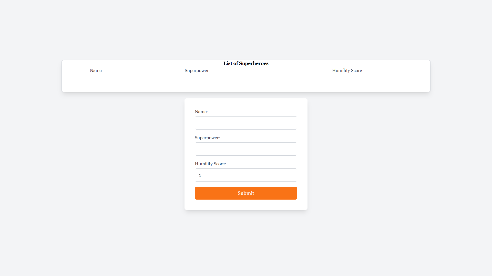
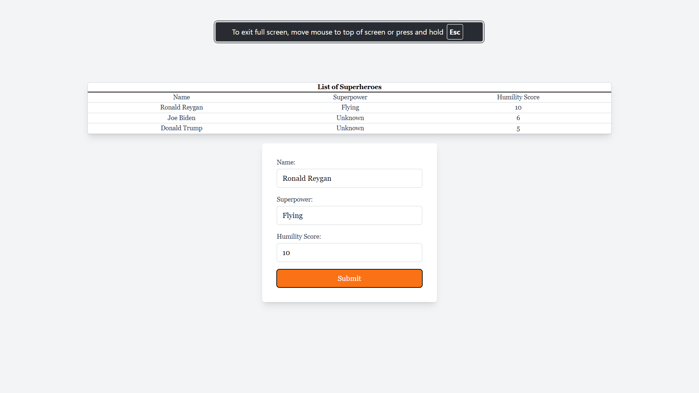

# Superhero App

## Description

This project implements a simple "Humble Superhero" app, where you can add superheroes with a name, superpower, and humility score. The data is stored in memory(just array, not even sqlite), and the API allows you to view the list of superheroes sorted by their humility score.

Also this app has frontend.


## How to Run

1. Clone the repository
2. Install backend dependencies: `npm install`
3. Install frontend dependencies: `npm install`
4. Start the backend server: `npm run start`
5. Start the frontend server: `npm run dev`

## Endpoints

- **POST /superheroes**: Adds a new superhero.
  - Request body: 
    ```json
    {
      "name": "Superman",
      "superpower": "Flight",
      "humilityScore": 8
    }
    ```

- **GET /superheroes**: Fetches all superheroes, sorted by their humility score in descending order.
    - Response:
        ```json
        [
            {
                "name": "Superman",
                "superpower": "Flight",
                "humilityScore": 8
            },
            {
                "name": "Batman",
                "superpower": "Intellect",
                "humilityScore": 7
            }
        ]
        ```

## Teamwork

If I were working with a team, I'd divide the tasks into frontend and backend. This would help speed up the process, as everyone can focus on their part. For small projects like this, I’d create a Trello board to lay out all the tasks and the necessary features, so we can all track our progress and stay aligned.

For example:
- One person could handle API routes, validation, and controllers (backend).
- Another could focus on the UI, user interactions, and frontend design (frontend).
- We could all collaborate on writing unit and integration tests to ensure everything works smoothly.

## Eagerness to Learn

If I had more time, I’d explore the following:

- **Database Integration**: Right now, the data is stored in-memory. I'd like to integrate MongoDB, PostgreSQL, or MySQL for a more persistent solution.
- **Advanced Validation**: I’d dig deeper into more advanced validation techniques in NestJS, like custom decorators.
- **Authentication and Authorization**: Adding JWT authentication would be a great addition, especially if the API starts dealing with more complex data and user-specific requests.
- **Better Testing**: While I’ve already written unit tests for the service and integration tests for the controller, expanding on edge cases and failure scenarios would further improve the reliability of the app.

P.S
In my previous project, one of the biggest on the project was writing documentation, to put it simply - documentation did not exist.
To solve this, I made sure to prioritize documentation from the start, adding clear and concise comments throughout the code and ensuring that the README was always up-to-date. I also set up a better Git flow tailored to the project's needs, which helped streamline collaboration and version control. This approach not only made it easier for everyone to contribute but also improved the overall maintainability of the project.